# Group Project: Design Journey

**You are encouraged to work ahead on everything on this project.** (Though we suggest you hold back on the interactivity until Project 3.) **Each section is required for a specific milestone. You are required to have these sections completed before that milestone's deadline.**

**Be clear and concise in your writing.** Bullets points are encouraged.

**Everything, including images, must be visible in Markdown Preview.** If it's not visible in Markdown Preview, then we won't grade it. We won't give you partial credit either. This is your warning.


# Client (Milestone 1)

## Client Questionnaire (Milestone 1)

Note: Before we get started, I would like to note that our team has looked over the documents you have provided us (the Climate Reality WNY Chapter Website document and the chapter strategic plan document), and we plan to combine the information provided during this meeting as well as these documents when designing the site.

1. Describe your organization and its purpose.

    - started by Al Gore
    - university chapters and geographical chapters
    - western NY chapter is just about a year old
    - members go through training to join a chapter
    - it is a movement to talk about climate change
    - meet and greet with people in the chapter on Nov 1 (client will send us the link if we would like a glimpse at the inner workings of the organization)


2. What makes your organization and its services special or unique?

    - unique in terms of focusing on Western New York state
    - this chapter is special in that it is one of many chapters across the country, opening the doors for collaborations with other chapters the rest of NY as well as other states
    - Western NY doesn't get that much attention, so this organization gives attention to areas that usually do not get attention and allows them to hone in on initiatives most relevant to the area
    - the chapter's geographical coverage includes an international border, making this chapter unique in that it opens the doors for international collaboration


3. Why are you looking for a new website or updating your existing site?

    - they do not currently have a website, they want a new website made from scratch
    - they currently have social media on multiple platforms, but they want a website that all these social medias can point back to, like a headquarters for the chapter
    - want new website specifically for this chapter


4. Who do you want to visit your site? Who is your site's target audience?

    - current members (they would provide this user for user interview)
    - new members (they would provide this user for user interviews)
    - non-members interested in the cause (we would seek out this user for user interviews on Cornell campus)
    - the audience as whole (member or not) are people living in western New York


5. When visiting your site, what actions do you want your visitors to take?

    - to learn more about the issue of climate change and what the people in Western NY are doing about it
    - to move people to action
    - showcase works of members (pictures, art, etc.)
    - list of resources that people can go to for more information on climate change
    - donate (client mentioned a donate button but we don't think this is possible in the scope of this project - so to implement something similar we would need a workaround, like linking to a donation site)


6. What are your goals for this site?

    - to drive people to the site and keep them on the site (we shared with the client how our job does not involve getting the users to the site but more so keeping the users on the site using design strategies learned throughout the course)
    - education; learning more about climate change
    - inspiration; they want users to see the site and feel the need to take action
    - increase membership (numbers, diversity of ages, race, etc.)


7. Is there a "feel" that you want for your site? Are there colors or imagery that you have in mind?

    - user had nothing particular in mind, so we discussed how our team has studied the impact of color scheme on the emotions a site evokes
    - client said they are open to our creativity, so we informed the client that earthy tones (browns, blues, greens) evoke a clean and natural feel which would complement the content of the site
    - upon hearing our ideas, the client mentioned that they did not want a gloomy feel, as in they do not want dark colors that evoke stress and a "the world is ending you better take action against climate change or else" vibe that makes users feel sad about the state of earth's climate
    - client wants users to feel happy on the site, and to not feel overwhelmed


8. What are your three favorite competitors or similar organizations' sites? Why?

    - had nothing particular in mind but the client will talk to their communication team and get back to us if they find sites they like and want to share with our team


9. Do you have content and imagery that you can provide us to include on your site?

    - giving us pictures, writings and artwork
    - will give us a compiled list of content this week
    - will give us exact blurbs after determining the main content topics (like what kind of content goes on each page after sharing with the client the results of the card sorting and different content organization iterations)


10. For this website implementation, we would try our best to meet your goals and requirements but we wanted to clarify that our team will not be able to include any type of form such as contact forms, mailing list forms, request forms, etc. Also, we won't be able to include Search which is beyond our abilities. However, we see that on your content document you shared with us, you described wanting a "join our chapter" and "subscribe to our email list" section. We will brainstorm workarounds such as linking to other websites rather than forms for these respective sections? Do you have any concerns, and questions, or any recommendations based on what I just said?

    - this question had the main purpose of informing rather than trying to elicit a certain answer
    - client acknowledged the limitations and we discussed the logistics of what happens after the project is over (i.e. we turn the site over to them and they find a hosting platform and they can update our site as needed)


11. What would be a reasonable time for both our team and you to reply to emails? It doesn't have to be very specific but an approximation/expectation of waiting time could help with effective communication (i.e. within 6 hours, 12 hours, etc.).

    - Within 24 hours
    - client understands that life gets busy, they will respond as quick as possible, whether that means in 5 minutes or by the next morning
    - exchanged phone numbers in case texting is an easier form of communication


12. How do you want to capture your audience's attention within the first 10 seconds of visiting the website.

    - clean, non cluttered (client shared example of site they felt was too cluttered in that the site had to many moving parts and pop-ups)
    - big font to make it easy to read for the older audience (possible interactive design based on this could be a font size increase button)


## Client Description (Milestone 1)
> Tell us about your client. Who is your client?
> Explain why your client meets the client rules in the project requirements.

  - Our client is **Climate Reality Western NY Chapter**. Our client shared with us their chapter overview, and they defined themselves as the following: "The Western New York Chapter encompasses a region that includes the major cities of Buffalo, Niagara Falls and Rochester, as well as the rural area in between, the approximate center of which is Batavia... Our mission is to involve the people of Western New York in making decisions that will preserve the natural resources of our world for future generations."
  - The client meets the client rules in the project requirements because we are not our own client, no team member is a member of the organization for which we are making a website, and no team member has a close personal relationship with the client.


## Client Website (Milestone 1)
> Tell us about the website that your client wants. Tell us the purpose of the website and what it is all about.
> NOTE: **If you are redesigning an existing website, give us the current URL and some screenshots of the current site.** (FireFox makes it easy to take a full screenshot of a page.) Tell us how you plan to update the site in a significant way that meets the project's requirements.

  - Our client wants to design a website from scratch that will act as the headquarters for all things related to the Climate Reality Western NY Chapter. The purpose of the website is to share information about this specific chapter, so what their mission is, what their current members have been working on, the initiative of the chapter, etc.


## Client Website Scope (Milestone 1)
> Your project should be ambitious, but not too large. A good rule-of-thumb is that you should have about 1 content-full page for each team member.
> Explain why the website you will create for your client isn't too small and isn't too big. Explain why you think it's the right size for this project.

  - We will make a homepage that grabs the attention of the audience and makes them want to learn more. A 'take action' page with the information provided to us by the client. A resource/ presentations page, a gallery page showcasing work done by members of the chapter, and a Contact us page that displays the clients social medias. This is exactly the right size for this project because we are challenging ourselves with taking on a lot of responsibility but between the 4 of us we can get it all done and more importantly get it all done well


## Client Goals (Milestone 1)
> What kind of website do they want? What are their goals for the site?
> There is no required number of goals. You need as many goals as necessary to reflect your client's desires.

  - Goal A: to attract and drive more people to the website (however we explained to the client that for us this leans more towards keeping the audience on the site once they are there, like maintaining their interest so they stay scrolling for longer)
  - Goal B: for education purpose - to make site's audience learn more about climate change
  - Goal C: to increase membership
  - Goal D: for Western NY - to make site's audience aware of what people in Western NY are doing
  - Goal E: to raise funds (declined due to the scope of this project)


## First Client Meeting Minutes/Notes (Milestone 1)
> Include your notes/minutes from the client meeting.

  - meeting took place on October 26 from 3:00-3:35PM over zoom. In attendance was Julianna, Jillian, Yvon, Yue Li, and Teresa Niedda (main point of contact for client)
  - our team members introduced ourselves (name, year, major)
  - Teresa introduced herself and described her role in the chapter and she described the chapter in general (its mission, how it operates, what region it pertains to, etc.)
  - Yvon and Jillian took notes throughout the meeting, chiming in as they saw fit while Julianna went through each questionnaire question with Teresa
  - the majority of the notes from the meeting are notes we took on Teresa's answers to the questionnaire questions. all these notes are found under the Client Questionnaire section
  - post-zoom meeting, Julianna added to the questionnaire notes by writing out additional things she remembered Teresa talking about during the meeting


# Plan/Schedule (Milestone 1)
> Make a plan of when you will complete all parts of this assignment.
> This plan is for your team. There is no required format. Format it so that it works for you!

  - We will meet once weekly to delegate responsibilities and go over what was done since the last meeting
  - We will find time to meet based on the clients availability
  - We will stay up to date in the group chat and say when we've completed our job
  - Finish HTML in one week
  - Finish CSS the week after HTML week
  - Finish JavaScript and revise HTML and CSS is necessary in two weeks after CSS week
  - Everything must be completed by November 29 so we have time to check it over and make changes


# Site Design/Plan (Milestone 2)

**Make the case for your decisions using concepts from class, as well as other design principles, theories, examples, and cases from outside of class.**

You can use bullet points and lists, or full paragraphs, or a combo, whichever is appropriate. The writing should be solid draft quality but doesn't have to be fancy.

## Understanding Users (Milestone 2)

### Audience (Milestone 2)
> Briefly explain your site's audience. Be specific and justify why this audience is a cohesive group with regard to your client's site. This audience should not be overly broad nor arbitrarily specific. It should be a cohesive group with similar _goals_.

The site's audience includes current members of the chapter (ranging from members who were there since the chapter was founded to brand new members) and non-members specifically interested in the cause of climate change and its impact on western New York. The audience as whole (member or not) are people living in western New York.


### User Interview Questions (Milestone 2)
> Plan the user interview which you'll use to identify the goals of your site's audience.

**User Interview Briefing & Consent:** Hi, I am a student at Cornell University. I'm currently taking a class on web design and for a project I am (re-)designing a web site for The Climate Reality Project Western NY Chapter. I'm trying to learn more about the people that might use this site. May I ask you a few questions? It will take about 10-15 minutes. You are free to quit at any time.

Interview Question for Members:
1. Please tell me a bit about yourself. You may omit any personal or private information.

2. Before officially joining the chapter, what information about the chapter did you seek out? How did you seek out this information?

3. How do you explain climate change to people who ask you about it, meaning what main things do you touch base on in your explanation?

4. Have you gone through training to become an official member of the chapter? If so, what resources did you need to complete the training?

5. When you became an official member of the chapter, did you seek out any information about the chapter's activities? If yes, what was that information. How did you obtain it?

6. As a member who has been in the organization for longer, what information do you feel you refer back to often? How do you seek out this information?

7. Have you ever felt you were not in the loop with information about the operations of the chapter? If so, what do you wish you were more informed about?

8. What haven't I asked you today that you think would be valuable for me to know in creating a website for The Climate Reality Project Western NY Chapter?

Interview Questions for Non-Members:
1. Please tell me a bit about yourself. You may omit any personal or private information.

2. Describe your interests in climate change and local organizations that advocate against it?

3. How do you explain climate change to people who ask you about it, meaning what main things do you touch base on in your explanation?

4. Have you ever searched online about climate change activism in western NY? If yes, explain what information made your research worthwhile in that it satisfied what you were looking for.

5. If you were to get involved in a local organization dedicated to activism about climate change, what are the first things you feel are necessary to know about said organization?

6. Have you ever attended an event about climate change (speaker panel, lecturer, anything of the sorts)? How did you find information about this event?

7. What haven't I asked you today that you think would be valuable for me to know in creating a website for The Climate Reality Project Western NY Chapter?

**After the interview:** This was really helpful. Thank you so much for agreeing to speak with me today. Have a great day!


### Interview Notes (Milestone 2)
> Interview at least 4 people from your audience. Take notes and include those notes here. Make sure to include a brief description of each interviewee.

**Interviewee 1:**

Interviewee Description: Professor E.Lombardi, Fall 2021 First-Year Writing Seminar BIOEE 1640 SEM 101 instructor at Cornell University
Interview Notes: (K: Kevin   I: Interviewee)

K: Hi, Professor Lombardi, I'm currently taking a class on web design and for a project I am designing a web site for The Climate Reality Project Western NY Chapter. I'm trying to learn more about the people that might use this site. May I ask you a few questions? It will take about 10-15 minutes. You are free to quit at any time.

I: Sure. Go ahead.

K: Awesome. The first question is "Please tell me a bit about yourself. You may omit any personal or private information."

I: **(1)** About me...I moved to New York for graduate. I studied in a climate change related field. We are living in the environment that's changing quickly. Family educated me a lot about environment...where drove me to receive formal education on a climate change related field.

K: Alright. So the second question is "Describe your interests in climate change and local organizations that advocate against it?"

I: Organization against it?

K: Yes. Local organizations that advocate against it.

I: **(2)** Come back to interests in doing everything I can to work towards an enjoyable and livable future for humans and for non-humans...because it would be devastatingly sad to lose diversity. The organization that works against it...would be (thinking)...I don't know...maybe the former local Republican representatives.

K: Alright. The third question is "How do you explain climate change to people who ask you about it, meaning what main things do you touch base on in your explanation?"

I: **(3)** Depends on how long the conservation would be. I would talk about the mechanisms, global warming, atmosphere, carbon dioxide emission that leads towards warming, and how living organisms are facing different conditions under climate change.

K: Cool. So the next question is very specific, which "Have you ever searched online about climate change activism in western NY?"

I: **(4)** No.

K: It's okay. We can move on to the next question, which "If you were to get involved in a local organization dedicated to activism about climate change, what are the first things you feel are necessary to know about said organization?"

I: **(5)** Who is leading. Check the background, its history, but who's leading could be very important.

K: Alright. The next question is "Have you ever attended an event about climate change (speaker panel, lecturer, anything of the sorts)? How did you find information about this event?"

I: **(6)** Yes. Mostly through Cornell Atkinson Center, and probably social media in general. And I would sometimes click on the links to the (specific) website.

K: Alright. And it brings to our last question: "What haven't I asked you today that you think would be valuable for me to know in creating a website for The Climate Reality Project Western NY Chapter?"

I: **(7)** Emm...I don't think there's anything else...about Western NY I don't have a clear question to ask you. It's just interesting how their information is accessible around the diverse people, like there's this scientific spectrum but there might not be a lot of scientists actually around the city...

K: Awesome. This is really helpful! Thank you so much for your help!


**Interviewee 2:**

1. Interviewee Description: Lynn is a retired high school social studies teacher. She lived in a small town in Wyoming county NY and is very active in church. She is now the chair of the western NY chapter and one of the founders.

2. In July of 2020, she took the climate reality project leadership training, so that is where she got a lot of her information about becoming a part of the new chapter. She also has a daughter who is the chair of a chapter in Massachusetts and her daughter encouraged her to create this chapter.

3. She said one of the functions of the climate project is education, and they have a whole library of slides to use to explain climate change to people. But Lynn said if she was just talking to someone, she would start out by talking about how things have changed in regards to climate change since she was young to today and the concerns she has for her grandchildren. Then she would go on to talk about major threats we see from climate change today in terms of wildfires, flooding, extreme weather, and what we can do as individuals or as a group or as a nation. She says it is important to get to the hope part and what we can do or else people get overwhelmed by the whole issue of climate change.

4. She said training used to be done in person but because of the pandemic it is done online. The training consists of four nights of zooms which were led by al gore but led by other individuals associated with the project as well. They went through the slides mentioned earlier. She said her one criticism with the training is that the first three nights are all about the problems, and the rest is about the solutions. But you need to go through three different evenings to get to the solutions, which can make people feel down. She also said they trainin thousands of people at a time. They get assigned a mentor and about 20 people are in your mentorship group where you share your feelings and your climate story. Her climate story was that she cannot imagine what life will be like when she ages. She added that there are videos that they can watch and learn more about specific topics.

5. She said this chapter is only about a year old, so it is very new. When founding the chapter, the idea was that no climate reality chapter west of Albany in the upstate part existed. Most of the chapter activities have been online since they started during the pandemic. There are monthly meetings, they do things with the new york state coalition of chapters (relatively new thing), and they send out weekly calls to action which are emails or phone calls or postings on social media to try and get legislatures and other influential people to do things to improve the climate overtime. Notifying is done through social media and emails. Phone numbers too and recently she has been texting to members.

6. The chapter is associated with the national chapter, and they have a regional coordinator, like a style guide, and she goes to the regional coordinator or national members or national employees (those are the only people who are professional, the rest are volunteers). She had to come up with a strategic plan and she refers to that plan when looking at what the goals are moving forward. She also has access to a site called reality hub which is used to contact other members throughout the country and internationally to ask a question and see who answers it, and al gore’s slides can be accessed there too.

7. Because she is the founder this question was ommitted.

8. She said it would be good to have a page where people can link to their assembly members and senators rather than having to look it up everytime (maybe in call to action page). NYC site has a section that just explains climate change and what's happening and some of the major effects, which she thinks helps people who are coming in cold. Highlight some of the work of members of the chapter like those who do art or essays or poetry or oppeds or letters. It is a good way to share their information and they want to engage people (members or not) through the chapter, and highlighting members is a good way to do that. She said they have a tendency to get very few people at the meetings. There are over 40 people in the chapter but only about 7 people are at the meeting. So we want them to feel like they are important as part of the chapter. She added that highlighting certain people who are willing to speak would be nice too.


**Interviewee 3:**

1. Interviewee Description: Anna is 27 years old and lives in western upstate NY. She is pursuing her PhD in ecology and evolution at Cornell University. She focuses on insects and pests, and she works with farmers and in agriculture.

2. Climate change is relevant to her job and her life’s purpose. The best thing she can do with her life is help farmers, and climate change really affects agriculture, so climate change is relevant to her research. Everything she does is through the lens of climate change and how it affects insects and pests. But she does not know much about specific local organizations. She did add that she reads the IPCC report every year so that is the closest she gets to organizations in particular and her interaction with what they do at the moment.

3. She would talk about greenhouse gas emissions. Like how humans produce CO2 and how that gets trapped in the atmosphere and heats it up, with the main points of evidence being CO2 increasing overtime and how temperature increases match the same timeline. She would use different models and focus on climate change deniers. She would also bring up the culture of science and how science is competitive in that scientists want funding by congress and there is a connection between public policy and climate change.

4. She says she has not, but if she were to google it she would look up protests to go to or action or certain bills and what the policies are and how her voting or protesting can change that.

5. She wants to know the time commitment, like how many meetings she would have to go to and if she needs to go through new member training. She would also want to see what kind of events they have and what the mission of the organization is to make she it aligns with what she believes in.

6. She regularly attended protests throughout college and after college in whatever town she was living in. She found out about those protests by posters, word of mouth, and news articles.

7. She says it is important to think about the target audience because “the hicks who don’t believe in climate change won't be going to a climate change website”. She suggested adding cute little videos to catch the eye. She also said to maybe gear towards the culture of western new york like hunting fishing and agriculture.


**Interviewee 4:**

1. Interviewee Description: Jackie has been a member of The Climate Reality national organization since she finished their training in late 2016, and she joined the western NY chapter as soon as she heard about it. She is a retired project manager of web systems, so she has had web developers work under her and she has maintained a lot of websites for M&T Bank (which is based in Buffalo). She was also the president of Project Management Institute. She retired in 2016.

2. Because she was already a part of the climate reality project national organization, she knew they were creating chapters and the western NY chapter reached out to her.

3. She never really thought about it since she has been so ingrained in the fact that climate change is here, but she said she would take information from the national climate reality site to explain.

4. She said training is different in 2016 compared to now. It is free and hers was a three day training but you pay for your own room (food was included). But now it is online so all you need is your brain and time and your computer.

5. Any information she needed she got from their content rich facebook page.

6. She said she does not have to refer back too often for stuff because they are very good at pushing communication but they have this thing called Call to Action where every week or sometimes multiple times a week they have a very well structured message that they ask members to send out to their congressmen via email or twitter to support climate change legislation. They send them via email and facebook.

7. No because they are pretty good with keeping members in the loop.

8. She said the most important thing is that there is only one page with “about us” kind of content. Good things to link to outside of this site is the facebook group for the chapter and organization and the national website. Have upcoming events front and center because the chapter wants to drive people to these events. Be very welcoming and upbeat and positive so add blurbs like “you are welcome to join us regardless of completing the training. We are looking for all professions and skill sets to help be part of this movement”. Remember that people do not join a group just to have more time constraints on their lives so tell people what they can do by joining. Also if they want to do this fight against climate change they want to be positive. She said to leverage what exists already and point to the resources especially because you are a static site.


### Goals (Milestone 2)
> Analyze your audience's goals from your notes above. List each goal below. There is no specific number of goals required for this, but you need enough to do the job (Hint: It's more than 1 and probably more than 2).

Goal 1: Know about past and upcoming events
- **Design Ideas and Choices** _How will you meet those goals in your design?_
  - we will implement an events page with information about past and upcoming events for the chapter
- **Rationale & Additional Notes** _Justify your decisions; additional notes._
  - member or not, users will want to know what the chapter is doing as a collective. Members will want to see upcoming events that they need to go to, while non-members will want to see past and future events to see if what the chapter does is something of interest to them.

Goal 2: Find out what the chapter is about
- **Design Ideas and Choices** _How will you meet those goals in your design?_
    - we will add information about the mission and vision of the chapter and explain the structure of the chapter (like how they are one chapter connected to the larger national organization)
- **Rationale & Additional Notes** _Justify your decisions; additional notes._
    - users want to know about who they are spending time reading a website about. It is apart of the immediate information they want to know, so we will provide it to them immediately on the homepage.

Goal 3: Find out how to become an official member
- **Design Ideas and Choices** _How will you meet those goals in your design?_
  - we will provide information about new member training.
- **Rationale & Additional Notes** _Justify your decisions; additional notes._
  - if users want to know how to become a part of the chapter, it is important they know the steps leading up to becoming an official member, like how there is a multi-day training program

Goal 4: Find out what they can do about climate change
- **Design Ideas and Choices** _How will you meet those goals in your design?_
  - we will implement a page about the chapter's Call to Action system where they send out weekly information about what you can currently do about climate change (i.e. contact senators)
- **Rationale & Additional Notes** _Justify your decisions; additional notes._
  - According to our interviews, our audience will need to know how they can contribute or get involved in the fighting for climate change. So the Call to Action website will be a great way for the audience to see weekly information about the specific thing they can do about climate change.

Goal 5: Be engaged with the chapter (members or not)
- **Design Ideas and Choices** _How will you meet those goals in your design?_
    - We will link all social media related to the chapter and the national organization. We will also have member spotlights to allow users to engage with what current members are doing for the chapter and the cause
- **Rationale & Additional Notes** _Justify your decisions; additional notes._
    - By linking the social media related to the chapter and the national organization. We will help the audience of our website get more involved with the chapter by attending even published by the chapter on social media and having an open space to chat and talk about climate change. Member spotlights will help our audience to know more about the chapter and its vision through the chapter members.


## Content Planning (Milestone 2)

**Plan your site's content.**

### Your Site's Planned Content (Milestone 2)
> List the content you plan to include your personal website. This should be a comprehensive list.

- chapter mission/vision
- history/geographical area
- DEIJ statement
- Member Spotlights
- new member training information
- links to social medias
- upcoming and past events
- how to join
- Call to action info


### Content Justification (Milestone 2)
> Explain (about a paragraph) why this content is the right content for your site's audience and how its addressed their goals..

This content is good for our site because it has just enough information that a user will have everything they need but not too much information, so the website is overwhelming. This content is the right content for our site's audience because it addresses the needs of members of the chapter and non-members interested in the chapter's specific cause, as outlined in their user goals. This content addresses user goals because what content we picked was based on achieving user goals. For instance, Goal 1 was to know past and upcoming events, so we made sure to include that in the site's planned content. Another example is that another user's goal was to find out what the chapter is about. Therefore, we made sure to include content about the chapter's mission, vision, DEIJ (Diversity, Equity, Inclusion, and Justice Statement), history, and geographical information. The process was the same for the other goals. We went through each goal and determined what content would be good to include in order for the users to achieve their goals.


## Information Architecture (Milestone 2)

### Content Organization (Milestone 2)
> Document your iterations of card sorting here.
> Include photographic evidence of each iteration of card sorting and description of your thought process for each iteration.


This design saw page for only having call to action and links to social media which we weren't sure was enough content, whereas page 1 had a lot more information than could probably fit on the one page.


This design combined pages 4 and 5 to make a complete 4th page. New member training info and how to join were also put on different pages.


This design had 5 pages which seemed like a bit much because the last two pages didn't have much content and we discarded this because we figured they could be combined.


### Final Content Organization (Milestone 2)
> Which iteration of card sorting will you use for your website?


> Explain how the final organization of content is appropriate for your site's audiences and their goals.

This card sort makes the most sense because there is enough content on each page to fill it but not have it be an overwhelming amount.


### Navigation (Milestone 2)
> Please list the pages you will include in your personal website navigation.

- Page 1: Home
- Page 2: Get Involved
- Page 3: Events
- Page 4: Member Spotlight


> Explain why the names of these pages make sense for your site's audience and their goals.

Since our final organization sort the content into four different groups, having four different navigation names corresponding to four web pages makes sense. Also, we intentionally attempted to keep the navigation names simple and easy to interpret since good navigation names should be self-explanatory and not the audience think. Lastly, given the content being carefully evaluated and categorized, the navigation names provide a general "overview" of the websites ("Home" "Get Involved" "Events" "Member Spotlight"), so that audience can locate the information/content they want quickly and effectively.


## Design (Milestone 2)

### Visual Theme (Milestone 2)
> Discuss several (more than two) ideas about styling your site's theme. Explain why the theme ideas are appropriate for your target audiences.
> Note the theme you selected for you site and why it's appropriate for the audience and their goals.

**Idea 1**
One potential theme is to make the site evoke a sense of nature. We will use blues and greens and browns because those colors are associated with the sky and nature (trees, grass, etc.). This is appropriate for my audience because they are trying to learn about a chapter that fights climate change and wants to protect the Earth, so we want the audience to be reminded of what they are fighting for (the Earth) by implementing the Earth's colors.

**Idea 2**
Another potential theme is to make the site evoke the emotions of passion, hope, and excitement. We would use light shades of warm colors like orange, yellow, red, and pink throughout the website, because warm colors evoke energy and lighter colors evoke happiness; moreover, yellow evokes excitement, red evokes passion, and pink evokes friendliness. This would be appropriate for out audience because we want the audience to feel feel excited and passionate about the cause of saving the Earth. Moreover, these colors will make users feel optimistic and hopeful, which is what we want them to feel. Our client specifically did not want users to feel depressed by how daunting climate change can be.

**Idea 3 - the idea we are picking**
A final potential design combines the needs of our client with components of the prior ideas. We like the idea of having the theme revolve around nature with blues and greens, so we will combine that idea with the main emotions we want our users to feel - passion and excitement. Therefore, we will want to use red (for passion) and yellow (for excitement). Moreover, upon communicating with the client, we were told that because the chapter is one of many connected to the national Climate Reality Project organization, there is a certain color palette the national organization would like us to follow. However, this color palette overlaps with what we want to convey our theme. There are greens, blues, red, yellow, and orange, and all these colors work out well with what we wanted to convey emotionally. This idea is appropriate for the audience and their goals because this idea combines the best aspects and reasonings of our prior ideas and can make the audience feel how the client wants them to feel as they navigate the site. Having a color palette just confirms what exact shades of each color we should pick. An image of the palette is shown below:
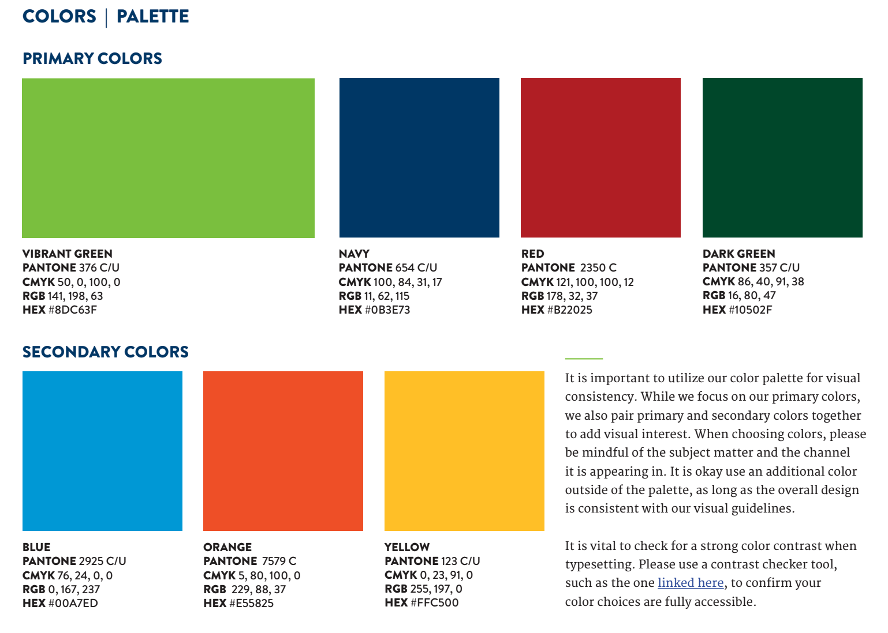


### Interactivity Ideas (Milestone 2)
> Brainstorm several ideas for your site's interactivity.
> Provide a very brief summary how each idea improves the usability of the site for the site's audience.

- Carousel: The Carousel will enable us to have slide show for the members Spotlight. This will improve the usability of the site because our audience will be able easily navigate through slides viewing the current members achievement. We also choose the Carousel because it is usually used for the slide show, and this will enhance the familiarity of our website.

- Gallery: we are planning to use the Gallery to easily present the photos of events or relevant photos. The Gallery will help our audience to navigate these photos easy. Also since the Gallery is familiar to our audience this will enhance the usability of our website.

- tabs on the call to action page to split up the info about joining and the call to action info. This way we can split up the content a little bit but not put it on a new page.

- see more links on the mission statement/vision. There is a lot of information in the mission statement so we could make it less daunting by adding see more.


### Layout Exploration (Milestone 2)
> Iterate on your site's design through sketching.
> Sketch both the mobile and desktop versions of the site.
> Here you are just exploring your layout ideas. You don't need to sketch every page.
> Provide an explanation for each sketch explaining the idea and the design patterns you are leveraging.

Desktop General Layout 1:
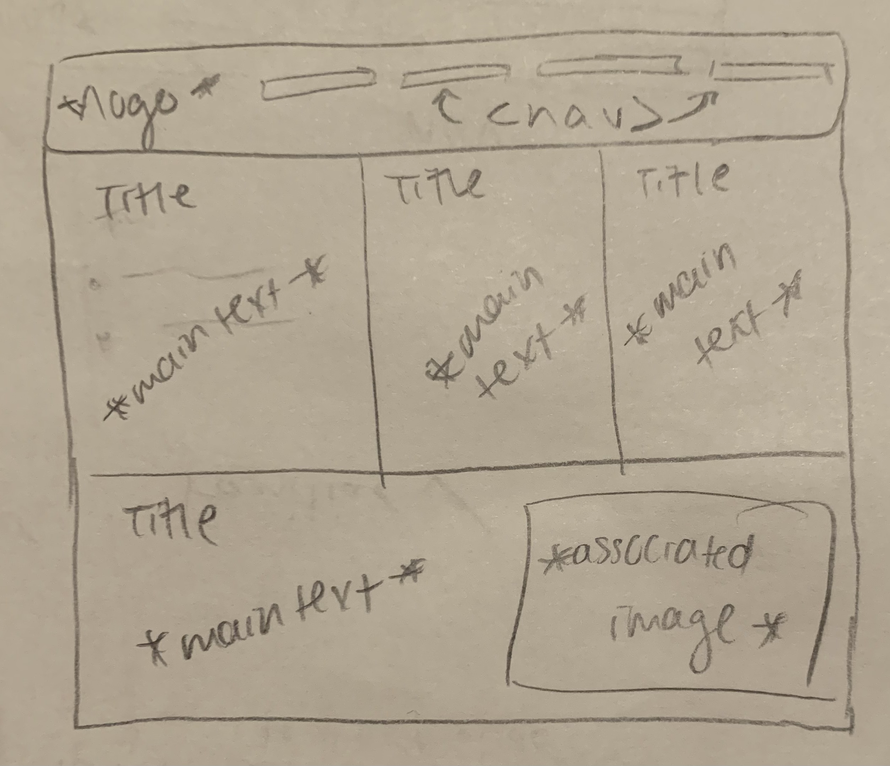
This layout takes into account that there may be multiple short chunks of content that can be organized into columns of one row, and larger chunks of content get their own entire row. Also, what is most important is getting across information about the festival rather than putting pretty pictures, so this layout does not involve an image per column.

Desktop General Layout 2:
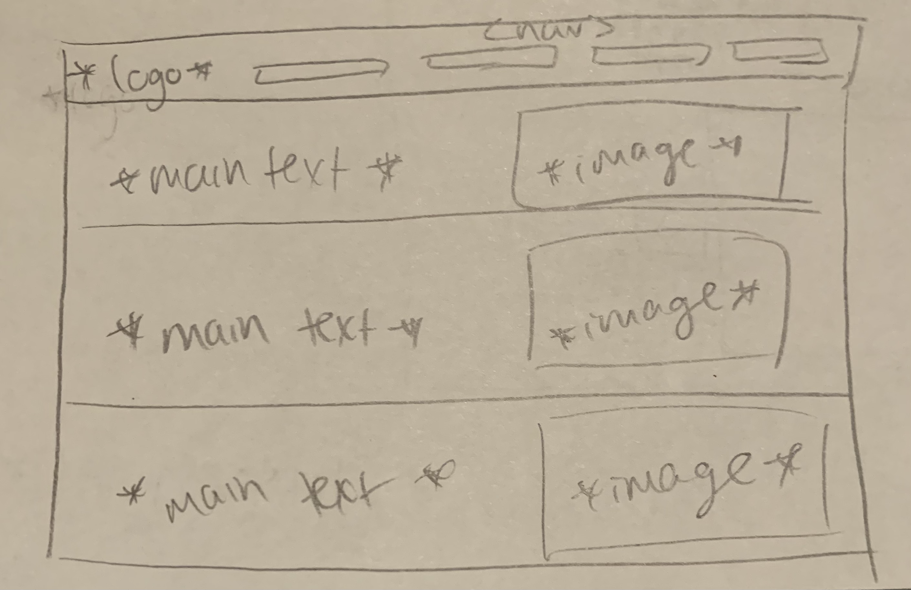
This layout design is based on using mostly the design pattern of reading left to right, because this layout uses only rows of information rather than columns. Also, each row has a visual component by adding an image to the right of the row (the image is associated with the content of that column).

Desktop General Layout 3:

This layout design is based on using mostly the design pattern of reading top to bottom, because this layout uses only columns of information rather than rows. Also, each column has a visual component by adding an image to the bottom of the column (the image is associated with the content of that column).

Mobile General Layout 1:
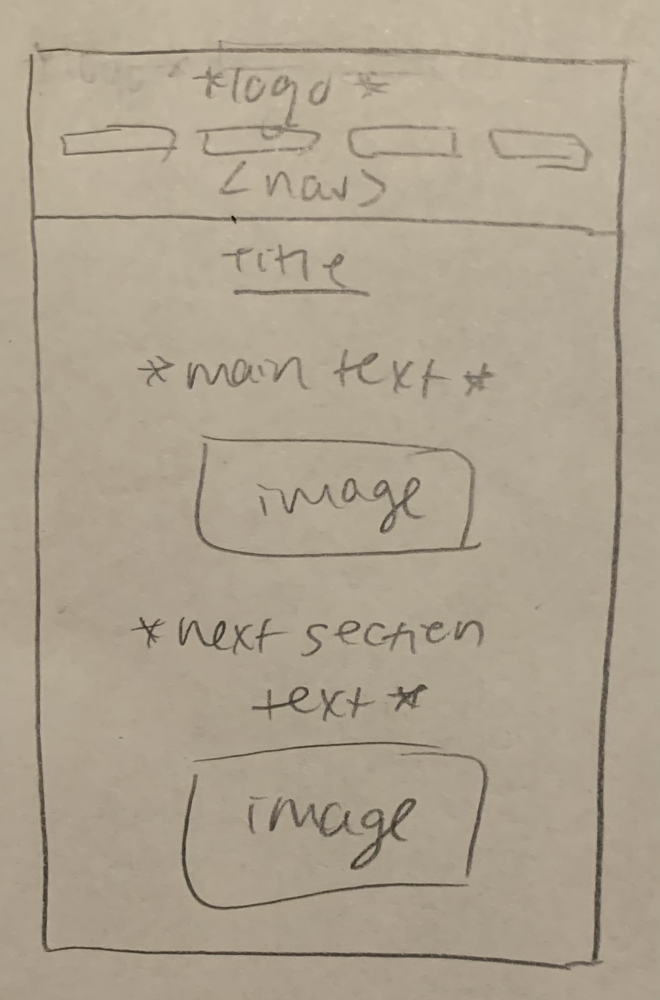
This layout design is based on taking the exact same sections in the desktop layouts, and place them one after the other. Specifically, sections of content will be transferred from left to right into top to bottom, with the leftmost section going first. However, the navigation bar will stay horizontal. Image use on the mobile layout will be limited in order to minimize scrolling, and font size will be increased as necessary to make content easy to read when placed on a smaller screen.

Mobile General Layout 2:
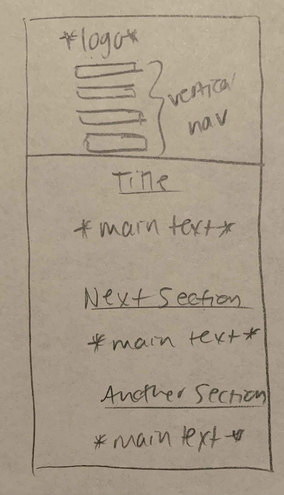
This mobile layout is the same as the first one BUT image use will be limited to only the images that are necessary, like the map for the land acknowledgment. We will add extra spacing to make it clear where one section stops and the next section of information begins. Moreover, in this layout the navigation bar will go from horizontal on the desktop to vertical on mobile.


### Final Interactivity Design (Milestone 2)
> Explain and/or provide annotated sketches of the interactivity you will implement for your site.
> Explain how the interactivity improves the usability of the site and helps the site's audiences meet their goals.


- This interactivity meets our users goal 5 because several interviewees wanted a member spotlight page and through the use of a carousel is a good way to show that. For example, we will showcase a photographer from the chapter by putting some of his photos into the carousel. It improves the usability too because it's interactive and easy for the user to navigate.


- This interactivity meets our user goals 3 and goal 5. The tabs make it easier to navigate the site and find out how to get involved for members and non members(call to action), and how to become an official member.


### Final Design (Milestone 2)
> Include the final sketches for **each** of your site's pages.
> The sketches must include enough detail that another 1300 student could implement them.
> Provide a explanation for each sketch.

**Mobile Design:**
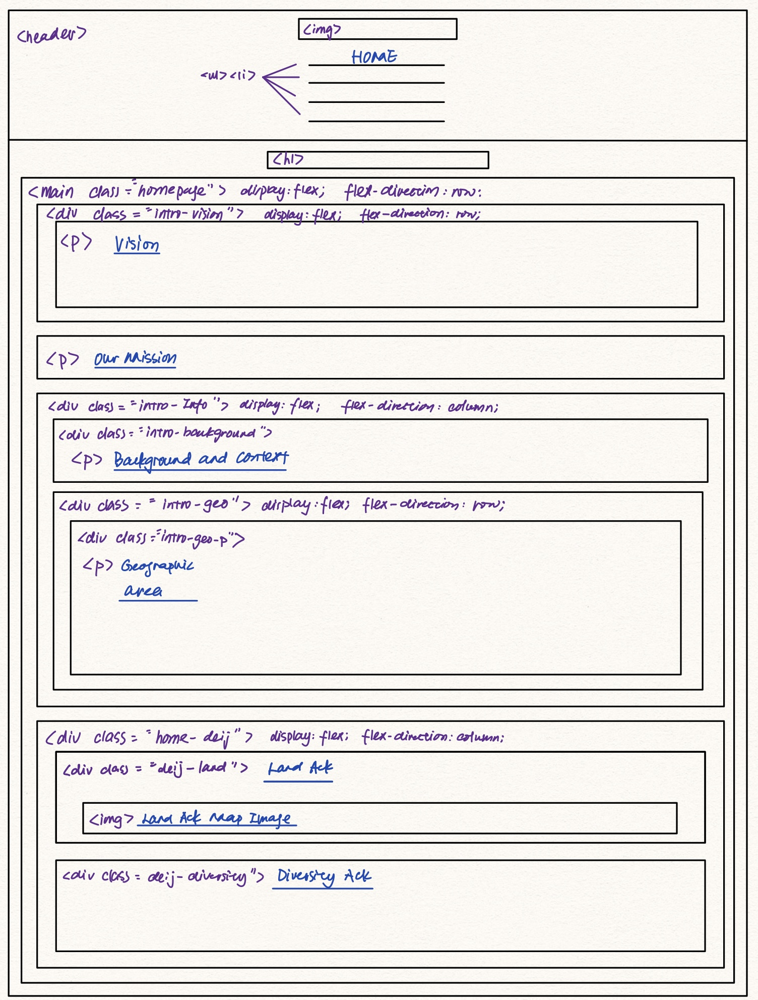
Final mobile design for the home page. Due to a smaller width limitation on the Mobile version, we have the logo image and the navigation bars displayed vertically in the header. The content is as well shown in flexbox vertically, which ensures the functionality of the responsive design when switching between mobile and desktop versions.


The mobile design for the get involved page starts with the logo of the chapter, then right below the vertical navigation, then the main heading, and then the tabs that users can click through.
**UPDATE**as per the request of our client after meeting them to get their feedback on the site, I will add a fourth tab called "Recent Successes". So the mobile is the same, but just imagine that the sketch includes that fourth tab (farthest to the right).

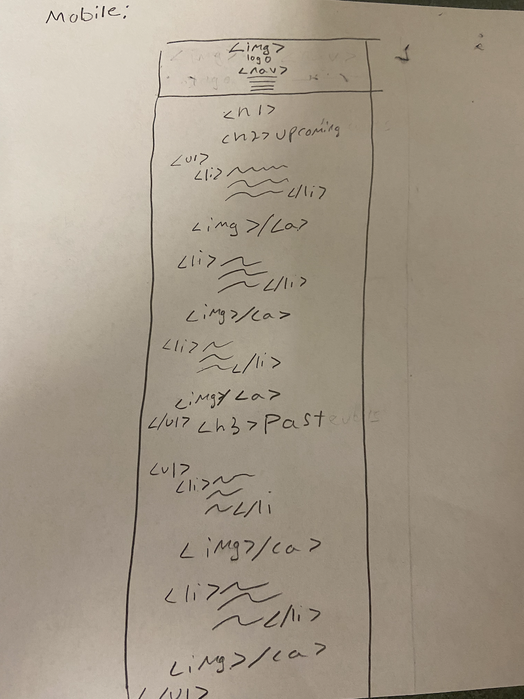
The mobile page will be responsive so that the pictures will be put under the list item.

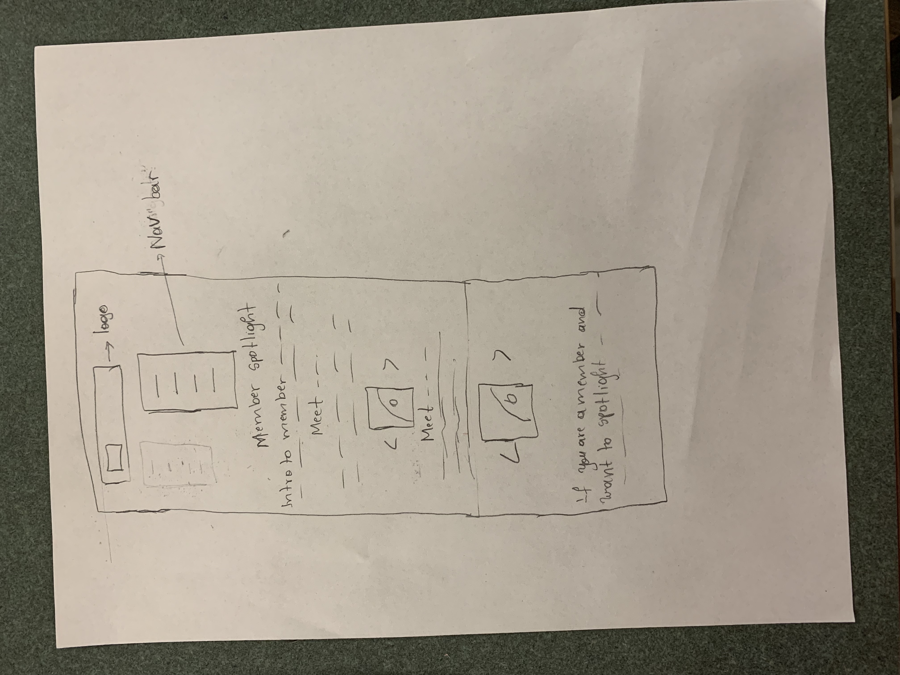
We choose this design pattern because it is familiar to our audience and it helps us present the member easily. Also this design uses the places provided by the mobile efficiently.  

**Desktop Design:**
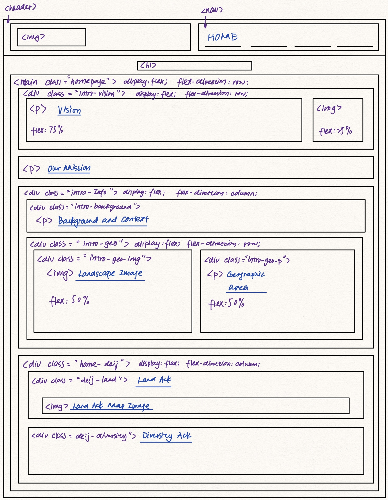
Final desktop design for the home page. Compared to the mobile version, it has more width/space so that the logo image and the navigation bars are displayed horizontally in the header. Also, there are two additional images added to the page, given more space available. The content is displayed in flexbox that ensures the functionality of the responsive design when switching between mobile and desktop versions.


The desktop design for the get involved page starts with a row where the logo of the chapter is on the top left and the horizontal navigation bar is to the right of the logo. Then right below is the main heading, and then the tabs that users can click through.
**UPDATE**as per the request of our client after meeting them to get their feedback on the site, I will add a fourth tab called "Recent Successes". So the desktop is the same, but just imagine that the sketch includes that fourth tab (farthest to the right).


The events will be in a list order with their respective images to the right of them.

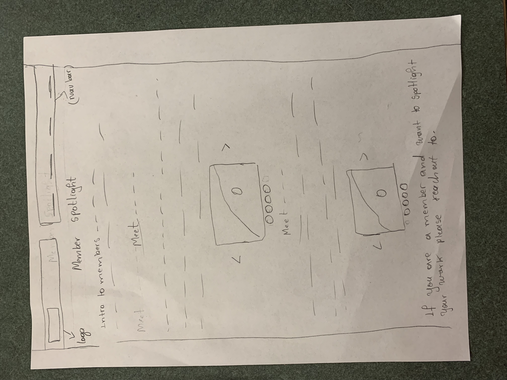
We choose this desktop design because our members can easily navigate through this page. also this design pattern is familiar to our audience.


### Design Rationale (Milestone 2)
> Explain why your design is appropriate for your audience. Specially, why does your content organization, navigation, and site design/layout meet the goals of your users? How did you employ design patterns to improve the familiarity of the site for your audience?

Our design is appropriate for our audience because we made it very easy to navigate and to understand. Each page is in the navigation bars as an understandable name, and in the case of the call to action page, it'd be divided into tabs to make it even more clear what content specifically you are looking at.


## Interactivity Plan (Milestone 2)
> Now that you've designed your interactivity for your site, you need to plan how you will implement it.
> Describe how you will implement the interactivity. This should be a complete plan that another 1300 student could use to implement the interactivity.
> You should list the elements, any CSS classes, events, pseudocode, and the initial state.

```
Tabs:
**UPDATE** as per the request of our client after meeting them to get their feedback on the site, I (Julianna) needed to add a fourth tab called "Recent Successes". I updated the interactivity plan for the tabs to reflect this change I will make in the code.

HTML:
- give class that identifies each tab:
`<div id='engageTab' class='tab'>`
`<div id='joinTab' class='tab'>`
`<div id='actionTab' class='tab'>`
`<div id='successTab' class='tab'>`
- add hidden class to tabs that are not showing when page first loads:
`<div id='joinTab' class='tab hidden'>`
`<div id='actionTab' class='tab hidden'>`
`<div id='successTab' class='tab hidden'>`
- create button that identifies each tab:
`<div id='engageButton'>`
`<div id='joinButton'>`
`<div id='actionButton'>`
`<div id='successButton'>`
- add active class to button connected to tab being shown when page first loads:
`<div id='engageButton' class='active'>`
- add script to bottom of html before </body>:
`<script src="scripts/jquery-3.6.0.js" type="text/javascript"></script>
<script src="scripts/tab.js" type="text/javascript"></script>`

CSS:
- `.tab` - style like a tab being shown on screen, default state
- `.hidden` - style to display none to hide inactive tabs
- `button` - style like a button, default (so not active) state
- `.active` - style like a button connected to the tab being show, so make it the same color as the visible tab
- `button:hover` - darken background on hover

Pseudocode:
when user clicks #joinButton do:
    add .active class to #joinButton element.
    remove .active class from #engageButton element.
    remove .active class from #actionButton element.
    remove .active class from #successButton element.
    remove .hidden class from #joinTab element.
    add .hidden class to #engageTab element.
    add .hidden class to #actionTab element.
    add .hidden class to #successTab element.

when user clicks #actionButton do:
    add .active class to #actionButton element.
    remove .active class from #engageButton element.
    remove .active class from #joinButton element.
    remove .active class from #successButton element.
    remove .hidden class from #actionTab element.
    add .hidden class to #engageTab element.
    add .hidden class to #joinTab element.
    add .hidden class to #successTab element.

when user clicks #engageButton do:
    add .active class to #engageButton element.
    remove .active class from #actionButton element.
    remove .active class from #joinButton element.
    remove .active class from #successButton element.
    remove .hidden class from #engageTab element.
    add .hidden class to #actionTab element.
    add .hidden class to #joinTab element.
    add .hidden class to #successTab element.

when user clicks #successButton do:
    add .active class to #successButton element.
    remove .active class from #actionButton element.
    remove .active class from #joinButton element.
    remove .active class from #engageButton element.
    remove .hidden class from #successTab element.
    add .hidden class to #actionTab element.
    add .hidden class to #joinTab element.
    add .hidden class to #engageTab element.


Carousel:

HTML:
- next button: `id = "next-button"`
- previous button `id = "previous-button"`
- class slides `class = "slides"`
- slide1 `class= "slide, id= "slide1"`
- slide2 `class= "slide, id= "slide2"`
- slide3 `class= "slide, id= "slide3"`
- slide4 `class= "slide, id= "slide4"`
- class dots `class = "dots"`
- button dot1  ` class= "dot", id = "dot1"`
- button dot2  ` class= "dot", id = "dot2"`
- button dot3  ` class= "dot", id = "dot3"`
- button dot4  ` class= "dot", id = "dot4"`

CSS:
- `#next-button` - light green background-color position: relative
- `#previous-button` - light  background-color position: relative
- `#previous-button :hover` - green-color position: relative
- `#next-button :hover` - green-color position: relative
- `.slide` - position relative
- `.dot` - position: relative, gray background-color
- `.dot:hover` brown background-color

Pseudocode:

When the left arrow is clicked do:
    remove .hidden class from the next slide
    add hidden to current slide
When the previous arrow is clicked do:
    remove .hidden class from the previous slide
    add hidden to current slide
when dot1 is clicked do:
    remove .hidden class from slide1
    add .hidden class to slide2, slide3, slide 4
when dot2 is clicked do:
    remove .hidden class from slide2
    add .hidden class to slide1, slide3, slide4
when dot3 is clicked do:
    remove .hidden class from slide3
    add .hidden class to slide1, slide2, slide4
when dot4 is clicked do:
    remove .hidden class from slide4
    add .hidden class to slide1, slide2, slide3
```


## Client Feedback & Minutes (Milestone 2)
> You should meet with your client again to obtain feedback on your design.
> Provide a summary of the client's feedback and your meeting's minutes.

- Met at 4:15 pm on November 16, 2021
- Explained the desktop site first and why content is laid out the way it is
- Then went through each page's responsiveness when moved to mobile
- Client liked the homepage; had no questions or comments
- Explained why tabs were used for interactivity to clean up the site
- Client was very happy with the get involved page; loved that we had links to the national organization as well as social medias for the local chapter.
- Client requested that another tab be added about recent success stories about The Climate Reality Project. Julianna said she will add that tab tonight.
- Explained the carousel feature and why we put it in the member spotlight page
- Client is sending us one more blurb to put into the member spotlight page
- Client asked if the colors went with the style guide from the national foundation. We responded that we followed the style guide that was provided to us by the national foundation and all of the fonts and colors are in line with what was provided to us.
- Client wants us to add the meeting upcoming in January to the upcoming events page, and will send us the information for us to input.
- Client wants a photo added of the leadership team.
- Meeting concluded at 4:50 pm November 16, 2021


# Evaluation (Final Submission)

## Finished Desktop & Mobile Website (Final Submission)
> Include screenshots of both the desktop and mobile version of your site that you will be using for user testing. (We need to see the "before" testing version of your site.)
> Use the FireFox screenshot feature to take screenshots of the entire page.

**Mobile Screenshots:**

**index.html**
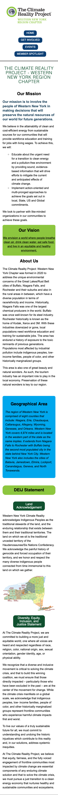
**involved.html**
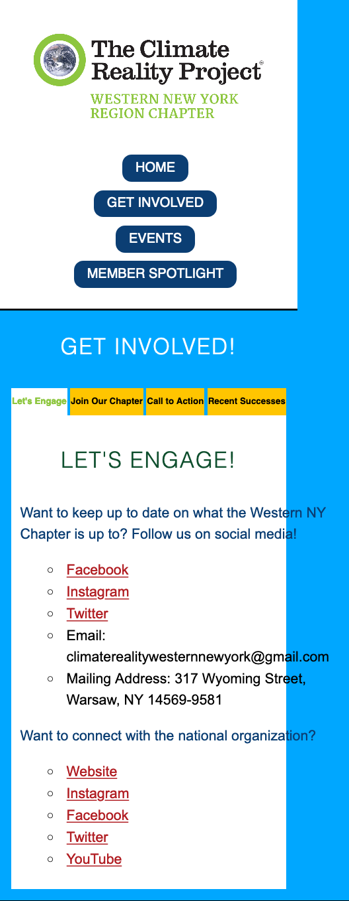
**events.html**
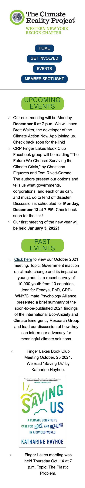
**member.html**
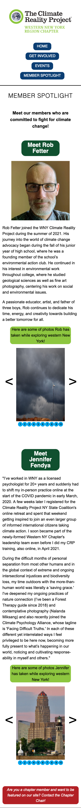


**Desktop Screenshots:**

**index.html**
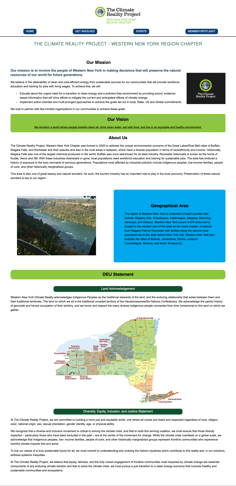
**involved.html**
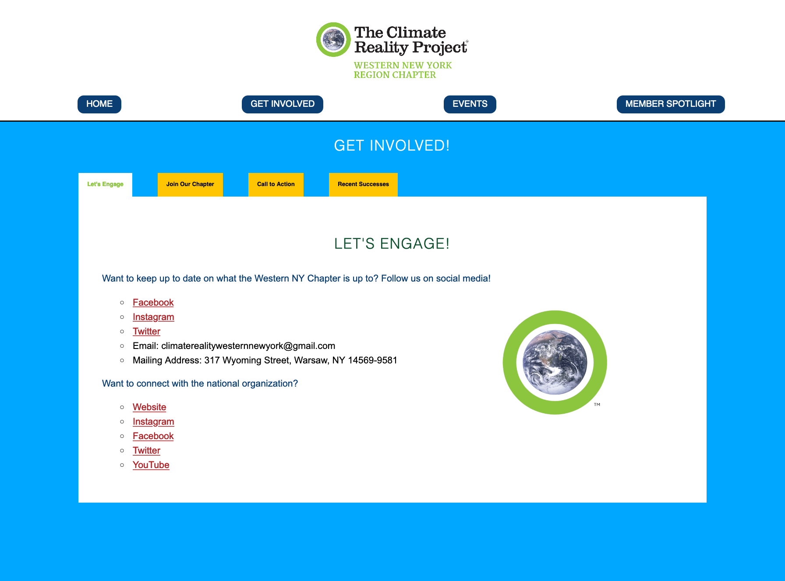
**events.html**
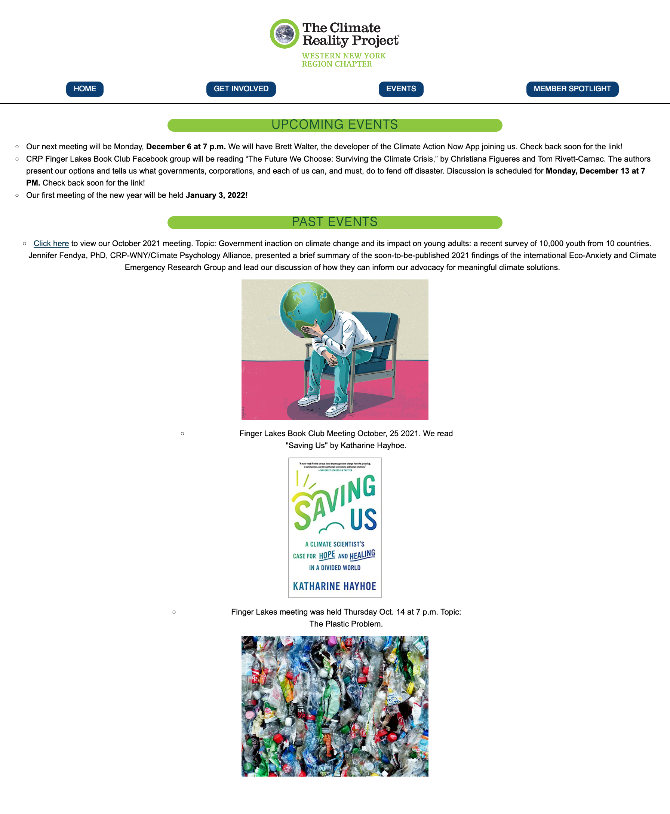
**member.html**
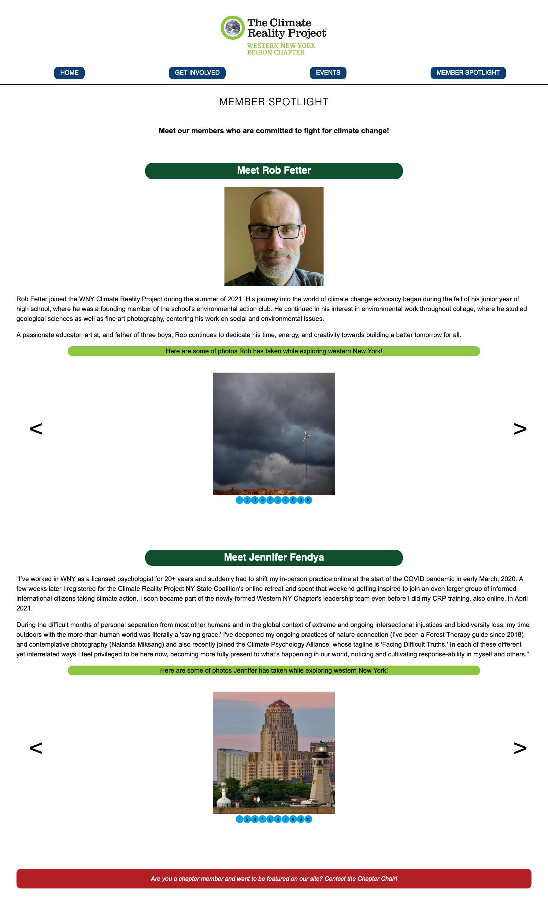


## User Testing (Final Submission)

**Conduct user testing with a minimum of 4 participants.**

### User Testing Tasks (Final Submission)
> Plan out your user testing tasks before doing your user testing. These must be actual user testing tasks. **Tasks are not questions!**

1. You've been living in Western New York for most of your lifetime, and you are thinking about joining an organization that would help address the local environmental concerns. Someone suggested the Climate Reality Project: Western New York Chapter and gave you their website. Look up the chapter's mission.

2. You are looking to join the Western New York chapter. Find the link that will tell you about new member training and how to sign up.

3. You are from the county of Wyoming in New York State. You want to know if this chapter of The Climate Reality Project is for where you live in New York. Look up if Wyoming county is one of the counties covered by the Western NY Chapter.

4. You missed the October 2021 chapter meeting and want to know what you missed. Look up the topic covered in the October 2021 chapter meeting.

5. You want to take part in Calls to Action but hate checking your email. Find an alternative way you can access Call to Actions.

6. You are a member who wants to have their essay about solar power to be featured on the website. Look up who you should contact in order to be featured.

### User 1 - Testing Notes (Final Submission)
> When conducting user testing, you should take notes during the test. Place your notes here.

K: Kevin   U: User

K: Thank you for agreeing to help me today. So for our user testing today, you will be testing a website. I will give you a few tasks. Try your best to complete these tasks. Also, I won't be able to help you or answer any questions during the test. Just try your best. You may quit at any time. Just let me know if you would like to stop the study.

U: User testing? That's how you call it.

K: Yes. It's not a test on you, but you will be testing the website that we made. Do you agree to participate in this study?

U: Yes. Let's get started.

K: Awesome. The first task is "you've been living in Western New York for most of your lifetime, and you are thinking about joining an organization that would help address the local environmental concerns. Someone suggested the Climate Reality Project: Western New York Chapter and gave you their website. Look up the chapter's mission."

U: (Had some troubles clicking through the website when attempting to use the remote control on an iPad instead of a laptop...scrolled down the home page and started reading the mission statement on the homepage)...so I found the mission statement on their page...(scrolled down further to About Us section)...so mostly their missions are here in the About US section and Our Mission section.

K: Awesome! We can move on to the next task. So "you are looking to join the Western New York chapter. Find the link that will tell you about new member training and how to sign up."

U: (Tried to scroll through the homepage but failed)...I can't see the whole home page [From this point, started to help the user navigate through each webpage] I'm gonna click on Get Involved Page...follow us on social media and connect with the national organization...(Click on the second tab "Join Our Chapter" and browse through content)...Then I went to Join Our Chapter...click here to sign up to become a member of the chapter...so probably I have...honestly, I guess you would click here to become a member...I don't know, but I guess I would go here (Navigate to Call to Action Page)...I want to see the Call to Action Page...click here to sign up that talks about the call to action...so hmm I would go to the Get Involved Page and click on the Join Our Chapter. You get a lot about leadership. Not until the bottom do you see the join chapter option. Instead of highlighting the existing members...it's kind of confusing that we have everyone's information. I guess you should have the professional background to join...you should be given direction. The page is not very good. I'm guessing because I'm familiar a little bit, but I would find this a bit too hard for those who don't know anything about the chapter...

K: That's great! Your comments would be very helpful! Let's move on to the next task: "you are from the county of Wyoming in New York State. You want to know if this chapter of The Climate Reality Project is for where you live in New York. Look up if Wyoming county is one of the counties covered by the Western NY Chapter."

U: (Scrolled up to the top of the page) Wait a minute (hesitated to click, then clicked Home Page. Scrolled down and stopped at the About Us Section. Clicked on the Geographical Area Section and started to read them)...What's interesting is that the geographical area is not clear. The region of Western New York is comprised of eight counties. If Rochester is included, it's one county...if that's what this means, then yes. I'm not sure, but that's what I'm interpreting.

K: That's awesome. We can move on to the next task: "you missed the October 2021 chapter meeting and want to know what you missed. Look up the topic covered in the October 2021 chapter meeting."

U: (Clicked on the Events Page) I clicked on the Events Page, and I saw her the past events. And click here to view our October 2021 meeting. It looks like it's bringing up a video or slides or something, which...I guess where it is.

K: Great! The next task is "you want to take part in Calls to Action but hate checking your email. Find an alternative way you can access Call to Actions."

U: (Navigated to Get Involved Page and clicked on Call to Action) I clicked to Call to Action...which I haven't done anything for the organization. You can access it through apps, and if you don't want to receive the email, you will download the apps. Maybe that would be another option.

K: Awesome! That brings us to our last task of today's user testing: "you are a member who wants to have their essay about solar power to be featured on the website. Look up who you should contact in order to be featured."

U: (Clicked on Member Spotlight Page and scrolled down) It looks like these people just have photos they've been taken. I didn't see the page...honestly, I really don't know. (Navigated to Get Involved Page and browsed through content under Let's Engage and Join Our Chapter tabs, and went back to Member Spotlight Page)...it's just the information you wrote about...maybe...these people would help you feature something...that would be my guess. It's unclear

K: Your response is very helpful. Thank you so much. That brings us to the end of today's user testing. So before we leave the zoom call today, do you have any questions about the website.

U: No...I guess for me being brand new to this (Clicked on the Get Involved Page)...what different media you can use to get involved. I guess, personally, I meant that it's important...(Clicked on Join Our Chapter tab). The most important thing is talking about joining, which should be on the front page. (Clicked on Call to Action) I guess for people who have not been involved, explain what a call to action is. Each week, we have a new call to action, and it takes a lot for calls to action...I have a master's degree in environmental science, but I think you would want to explain what a call to action is. I don't know. It's just my feelings.

K: Your feedback is very important and would be helpful for us to revise the website accordingly. Thank you so much! If you don't have any questions, I'll say a fantastic job on today's user testing. I really appreciate it.


### User 1 (Final Submission)
> Using your notes from above, describe your user by answering the questions below.

1. Who is your user, e.g., where does the user come from, what is the user's job, characteristics, etc.?

User: Mary Merner. Mary is a new member of the Climate Reality Project. She has a master degree in environmental science and have strong interests in addressing environmental concerns both within the Western New York Chapter and some other chapters.


2. Does the user belong to your audience of the site? (Yes / No)
> If “No”, what’s your strategy of associating the user test results to your audience’s needs and wants? How can your re-design choices based on the user tests make a better fit for the audience?

Yes. The user is a new member of the Climate Reality Project, who would use this website to get information about the Western New York Chapter.


### User 1 Results (Final Submission)
> Report the results of your user's test. You should explain **what the user did**, describe the user's **reaction/feedback** to the design, **reflect on the user's performance**, determine what **re-design choices** you will make **for EACH task**. You can also add any additional comments.

Task: TODO: copy task here
- **Did you evaluate the desktop or mobile design?**
  - desktop

- **How did the user do? Did they meet your expectation?**
  - Overall, the user did well, though I was expecting her to do a bit better.

- **User's reaction / feedback to the design** (e.g., specific problems or issues found in the tasks)
  - Overall, the user appreciated the desktop version design of the website. No specific issues were found through user-testing besides the user was unable to complete the last task-to find contact information for an article to be featured. The specific method was displayed at the bottom of the Member Spotlight page. Possibly due to the technical difficulty of remote control, the user found some troubles scrolling down to the bottom of the page and eventually ended up missing the information. In addition, the user did provide some feedbacks, especially to the tabs' content of the Get Involved Page, which we might consider revising our that webpage accordingly.

- **Your reflections about the user's performance to the task**
  - I really appreciate how my user performed the tasks. She was very helpful and always attempted to provide additional comments that helped me better understand the issues/problems she found.

- **Re-design choices**
  - Task 1: The user completed the first task correctly and quickly, which I don't think we have to re-design the Home Page to make the information more obvious and easier to locate.
  - Task 2: The user completed this task correctly but came up with many comments and suggestions on the Join Our Chapter tab. According to her comments, we might re-design this tab to switch the order between the existing member's leadership section and the "join our chapter" section.
  - Task 3: The user completed the task using her logic and assumptions, which should not happen in web design since we should not make user think. Thus, we might re-design the About Us section and Geographical Area section on the Home Page to explain the coverage of the Western New York Chapter better without confusion.
  - Task 4: The user completed this task correctly and quickly, which there's no reason to believe that we have to re-design the Event Page to make the information easier to locate.
  - Task 5: The user completed this task correctly and quickly by providing an alternative way to participate in Call to Action other than checking email. Thus, I don't think we have to re-design the Call to Action tab of the Get Involved Page.
  - Task 6: The user was unable to complete this task primarily due to the technical difficulty of using remote control on an iPad. I don't think it would be the main problem, but we might re-design the Member Spotlight page by making the featured information at the top of the page to make it more obvious.

- **Additional Notes**
  - Specific re-design choice corresponding to each task was justified as above. The only other thing that is worth mentioning here is that the user provided additional feedbacks to the Get Involved Page. We might re-design the Get Involved Page so that some other more important tabs like Call to Action or Join Our Chapter appear at the beginning while making the Let's Engage (contact information) tab appear later. Also, we might add a bit more background information about what a call to action is in the Call to Action tab to make it more self-explanatory.


### User 2 - Testing Notes (Final Submission)
> When conducting user testing, you should take notes during the test. Place your notes here.

Task 1:
- user starts off on the home page
- does not have to scroll, user instantly sees mission statement at top of homepage

Task 2:
- user says they will try get involved page
- scrolls through let’s engage
- does not see anything useful so goes to Join our chapter tab
- user scrolls through  page
- hovers over green square that says "Wants to join the movement too? Here are the main things you should do:"
- user clicks the correct link

Task 3:
- user hovers over navigation bar
- user does not see navigation bar explicitly about geography, so they go to homepage, saying they assume general info about the chapter will be there
- scrolls through slowly, reading subtitles as they go
- reads geographical area subtitle and hovers over written text
- sees the list of 8 counties in the first sentence and says yes Wyoming is included in the chapter

Task 4:
- user goes to event page
- user notes sees next meeting and last events
- user sees October 2021 listed
- user hovers over description
- user clicks on video link
- user says he wishes there was an agenda because he does not want to watch the full 1 hour and 15 minute video to sum up the topic

Task 5:
- user clicks get involved tab
- user sees Call to Action tab, clicks tab
- user clicks link that takes you to form that signs you up for emails
- does not see anything besides emails and user says he does not want emails so he goes back to page and scrolls more
- user sees that the climate action app can be downloaded and includes Calls to Action

Task 6:
- user goes to member spotlights page to find out more about featured people
- user scrolls through page
- scrolled to bottom of member spotlights page but then clicks back to home page
- user scrolls through home page
- user clicks back on member spotlights page
- user scrolls down again and hovers over written text for longer
- user finds note about contacting chapter chair


### User 2 (Final Submission)
> Using your notes from above, describe your user by answering the questions below.

1. Who is your user, e.g., where does the user come from, what is the user's job, characteristics, etc.?

My user is Michael Laird. He is a 74 year old man living in Pittsford NY near Rochester. He is now retired but he used to be the VP of software development of production Xerox machines.


2. Does the user belong to your audience of the site? (Yes / No)
> If “No”, what’s your strategy of associating the user test results to your audience’s needs and wants? How can your re-design choices based on the user tests make a better fit for the audience?

Yes because Michael is a member of the Climate Reality Project and has been through official new-member training. He attends both the Finger Lakes Chapter and the Western New York Chapter.


### User 2 Results (Final Submission)
> Report the results of your user's evaluation. You should explain **what the user did**, describe the user's **reaction/feedback** to the design, **reflect on the user's performance**, determine what **re-design choices** you will make **for EACH task**. You can also add any additional comments.

Task: You've been living in Western New York for most of your lifetime, and you are thinking about joining an organization that would help address the local environmental concerns. Someone suggested the Climate Reality Project: Western New York Chapter and gave you their website. Look up the chapter's mission.
- **Did you evaluate the desktop or mobile design?**
  - mobile
- **How did the user do? Did they meet your expectation?**
  - The user did well and met my expectations.
- **User’s reaction / feedback to the design** (e.g., specific problems or issues found in the tasks)
  - User found no issue with the task.
- **Your reflections about the user’s performance to the task**
  - User was quick to analyze what was right in front of him and find the information needed to complete the task.
- **Re-design choices**
  - None
- **Additional Notes**
  - I feel a re-design choice is not necessary because the user was able to interact with the site efficiently.

  Task: You are looking to join the Western New York chapter. Find the link that will tell you about new member training and how to sign up.
  - **Did you evaluate the desktop or mobile design?**
    - mobile
  - **How did the user do? Did they meet your expectation?**
    - The user did well and met my expectations.
  - **User’s reaction / feedback to the design** (e.g., specific problems or issues found in the tasks)
    - User found no issue with the task.
  - **Your reflections about the user’s performance to the task**
    - User was quick to utilize the navigation bar and go through the tabs to find the information needed to complete the task.
  - **Re-design choices**
    - Move the section of information about how to join the movement above the section with the group photos.
  - **Additional Notes**
    - This re-design choice will make it so that the most useful information is placed first to be accessed more quickly by the user.

Task: You are from the county of Wyoming in New York State. You want to know if this chapter of The Climate Reality Project is for where you live in New York. Look up if Wyoming county is one of the counties covered by the Western NY Chapter.
    - **Did you evaluate the desktop or mobile design?**
      - mobile
    - **How did the user do? Did they meet your expectation?**
      - The user did well and met my expectations.
    - **User’s reaction / feedback to the design** (e.g., specific problems or issues found in the tasks)
      - User found no issue with the task.
    - **Your reflections about the user’s performance to the task**
      - User was quick to utilize the navigation bar and utilize subtitles to effectively skim through home page content in order to find the information needed to complete the task.
    - **Re-design choices**
      - None
    - **Additional Notes**
      - I feel a re-design choice is not necessary because the user was able to interact with the site efficiently.

      Task: You missed the October 2021 chapter meeting and want to know what you missed. Look up the topic covered in the October 2021 chapter meeting.
          - **Did you evaluate the desktop or mobile design?**
            - mobile
          - **How did the user do? Did they meet your expectation?**
            - The user did okay but did not meet my expectations.
          - **User’s reaction / feedback to the design** (e.g., specific problems or issues found in the tasks)
            - User found no issue with the task except that he did not want to watch the long video recording of the meeting (however he did not need to watch this video to complete the task).
          - **Your reflections about the user’s performance to the task**
            - User was quick to utilize the navigation bar but was too quick in clicking links. User did not look through content with enough depth.
          - **Re-design choices**
            - Bold the word "Topic"
          - **Additional Notes**
            - This re-design choice will make it very clear what the topic of the meeting is, so the user does not feel the need to watch the entire video to get the gist of the meeting.

Task: You want to take part in Calls to Action but hate checking your email. Find an alternative way you can access Call to Actions.
                - **Did you evaluate the desktop or mobile design?**
                  - mobile
                - **How did the user do? Did they meet your expectation?**
                  - The user did well and mostly met my expectations.
                - **User’s reaction / feedback to the design** (e.g., specific problems or issues found in the tasks)
                  - User found no issue with the task.
                - **Your reflections about the user’s performance to the task**
                  - User was quick to utilize the navigation bar and tabs but was too quick in clicking links. User did not look through content with enough depth.
                - **Re-design choices**
                  - Move the section about the Climate Action Now app above the section with the example of the Call to Action.
                - **Additional Notes**
                  - This re-design choice will make it so that the most useful information is placed first to be accessed more quickly by the user.

Task: You want to take part in Calls to Action but hate checking your email. Find an alternative way you can access Call to Actions.
 - **Did you evaluate the desktop or mobile design?**
    - mobile
 - **How did the user do? Did they meet your expectation?**
        - The user did okay and mostly met my expectations.
  - **User’s reaction / feedback to the design** (e.g., specific problems or issues found in the tasks)
    - User found no issue with the task except that he felt it took to long too find the information.
      - **Your reflections about the user’s performance to the task**
        - User was quick to utilize the navigation bar and tabs but was too quick in scrolling through content. User did not look through content with enough depth and therefore ended up spending longer than he needed on pages he did not need to visit.
  - **Re-design choices**
        - Give a concrete way to contact someone to be featured.
      - **Additional Notes**
            - This re-design choice will make it so that the user can find who to contact and exactly HOW to contact them.


### User 3 - Testing Notes (Final Submission)
> When conducting user testing, you should take notes during the test. Place your notes here.

Task 1: She expected it to be on the homepage. She started scrolling on the homepage to find it. She found it towards the bottom of the page.

Task 2: She clicked on the get involved page and scrolled to "lets engage" but it wasn't there. She next clicked on the join our chapter tab and scrolled down to fidn the link. She was confused about if she has to do the training to be a member so I explained to her if she scrolled down more there was a note about that at the bottom to explain.

Task 3: She scrolled up from the current page and went through to the get involved page. She didn't find anything there. So she went to the home page and scrolled down to "geographical area" and found Wyoming County. She asked if we should repeat the areas on the get involved page too.

Task 4: She scrolled up to the top and clicked "events." She looked under past events and clicked the link for the October 2021 meeting.

Task 5:She clicked on "get involved" and then clicked on the "call to action" tab. She scrolled down past the email part and found the app that will also give her the call to action information.

Task 6: She scrolled up and went to member spotlight. She scrolled all the way down and found the note to contact the chapter chair. She noted that we should have the email address and name of the chapter chair right on that note so that the user doesn't have to go looking through the website.


### User 3 (Final Submission)
> Using your notes from above, describe your user by answering the questions below.

1. Who is your user, e.g., where does the user come from, what is the user's job, characteristics, etc.?

Paula Welling is a member of the finger lakes chapter with Lynn and got did training in 2020 bc she wanted to get more involved with climate change and wanted opportunities to make a difference. She is actually a ui designer.


2. Does the user belong to your audience of the site? Yes
> If “No”, what’s your strategy of associating the user test results to your audience’s needs and wants? How can your re-design choices based on the user tests make a better fit for the audience?

### User 3 Results (Final Submission)
> Report the results of your user's evaluation. You should explain **what the user did**, describe the user's **reaction/feedback** to the design, **reflect on the user's performance**, determine what **re-design choices** you will make **for EACH task**. You can also add any additional comments.


- **Did you evaluate the desktop or mobile design?**
  - mobile
- **How did the user do? Did they meet your expectation?**
  - She met my expectation with flying colors she was very quick at completing all the tasks.
- **User’s reaction / feedback to the design** (e.g., specific problems or issues found in the tasks)
  - She said the website is very clear. She said it has a lot of text but it's okay because its straightforward and functional.
- **Your reflections about the user’s performance to the task**
  - Being a ui designer I had a feeling she would quickly complete the tasks and she did.
- **Re-design choices**
  - She said we should get rid of underlines for text that are not links.
  - We will also put more information about who to contact from task 6.
- **Additional Notes**
  - I will make the above changes.


### User 4 - Testing Notes (Final Submission)
> When conducting user testing, you should take notes during the test. Place your notes here.

Y: Yvon, U: user

Y: Thank you for agreeing to help me today. So for our user testing today, you will be testing a website. I will give you a few tasks. Try your best to complete these tasks. Also, I won't be able to help you or answer any questions during the test. Just try your best. You may quit at any time. Just let me know if you would like to stop the study.

U: Yes, I've done this before so it should be easy.

Y: Okay, thank you so much, let's get started. My first task is,"You've been living in Western New York for most of your lifetime, and you are thinking about joining an organization that would help address the local environmental concerns. Someone suggested the Climate Reality Project: Western New York Chapter and gave you their website. Look up the chapter's mission.
"
U: The user quickly finds this information on the homepage of the website.

Y: Great, that was easy. My second task is, " You are looking to join the Western New York chapter. Find the link that will tell you about new member training and how to sign up."

U: The user clicks get involved webpage. After scrolling through the website the user decided to click "website" under "want to connect with the national organization". The user can't find this information on that website. The user decided to go back to the get involved webpage and clicks join our chapter tab. The user finds this information on that tab.

Y: Awesome, my next question is, "You are from the county of Wyoming in New York State. You want to know if this chapter of The Climate Reality Project is for where you live in New York. Look up if Wyoming county is one of the counties covered by the Western NY Chapter."

U: The user clicks events webpage, the user skims through this webpage but she can't find this information. The User finally decided to go to the Home page and she finds this information under "Geographical Area".

Y:Thank you, my next task is "You missed the October 2021 chapter meeting and want to know what you missed. Look up the topic covered in the October 2021 chapter meeting.""

U: The user clicks events webpage. The user finds this information under the "past event".

Y: Thank you so much. My fifth task is, "You want to take part in Calls to Action but hate checking your email. Find an alternative way you can access Call to Actions."

U: The user clicks the get involved navigation bar. The user clicks call to action tab, and finds this information there.

Y: Awesome, my last task is, "you are a member who wants to have their essay about solar power to be featured on the website. Look up who you should contact in order to be featured"

U: The user says that's easy. The user clicks the "member spotlight" navigation bar. The user scroll through the webpage and finds this information at the end of the webpage

Y: Thank you so much that was all the tasks I had for you. Do you have any questions for me.


### User 4 (Final Submission)
> Using your notes from above, describe your user by answering the questions below.

1. Who is your user, e.g., where does the user come from, what is the user's job, characteristics, etc.?

- My user is Laura Gardner and she is a member of the Western New York Chapter


2. Does the user belong to your audience of the site? (Yes / No)
> If “No”, what’s your strategy of associating the user test results to your audience’s needs and wants? How can your re-design choices based on the user tests make a better fit for the audience?

 - Yes the user belong to the audience of the website


### User 4 Results (Final Submission)
> Report the results of your user's evaluation. You should explain **what the user did**, describe the user's **reaction/feedback** to the design, **reflect on the user's performance**, determine what **re-design choices** you will make **for EACH task**. You can also add any additional comments.

Task: TODO: copy task here
- **Did you evaluate the desktop or mobile design?**
  - Desktop
- **How did the user do? Did they meet your expectation?**
  - The user did pretty well. It was mostly easy for the user to complete all tasks
- **User’s reaction / feedback to the design** (e.g., specific problems or issues found in the tasks)
  - It was easily for the user to understand the tasks she was supposed to complete, and overall she completed those tasks. However, the user had trouble completing the second and the third tasks.

- **Your reflections about the user’s performance to the task**
  - The user did a great job of first understanding the task and then trying to complete it. The user all did a great job of asking for clarification whenever she didn't fully understand the task
- **Re-design choices**
  - Task 2:
    On the get involved webpage, change the link to the national organization website from, "Website" to "National Organization website"
  - Task 3:
    Make the names of the states covered by the Western New York bold.

- **Additional Notes**

  - I will make the changes described above, because by changing the name of the link to the National Organization to "National Organization website", it will be easy for my audience to different this link from the "join our chapter" tab
  - By making the names of the states covered by the western New York bold, it will increase the visibility of this information which will help my audience to easy find which states are covered by the Western New York Chapter.


## Changes Based on User Testing (Final Submission)
> What changes did you make to your design based on user testing?

After talking through our combined user testing results and what we feel will best improve usability for the site, we will make the following changes:

1. We will remove the underline from written text that is not a direct link to lessen confusion in regards to what written text is and is not an actual link.

2. Give a concrete way to contact someone to be featured on the member spotlight page. We will edit HTML so that it says to email the chapter's email and we will provide that exact email.

3. We will bold text that needs to be emphasized in order to catch the readers eye, like the list of the 8 countries included in the chapter's geographical range and phrases like "Topic" on the events page.

4. We will restructure sections to put the most relevent information towards the top of the page. For example, we will move the section about the Climate Action Now app above the section with the example of the Call to Action. We will also move the section of information about how to join the movement above the section with the group photos.


## Final Notes to the Graders (Final Submission)
> 1. Give us three specific strengths of your site that sets it apart from the previous website of the client (if applicable) and/or from other websites. Think of this as your chance to argue for the things you did really well.

TODO

> 2. Tell us what you, as a team, learned while working on this project.

TODO

> 3. Tell us anything else you need us to know for when we're looking at the project.

TODO
